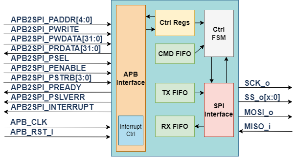

# QSPI controller
An APB4-based and AXI4-based Quad SPI Master Controller

Currently only an APB3 Design(accepts only 32bit transfer)

## structure
 NOTE: this is the structure of an old version!

 

## Parameters:

```text
SPI_MODE: value 0-3 fixed mode CPOL,CPHA
          otherwise (eg, 4) programmable mode in control reg[1:0]
```

## Registers map:

```text
base+0 RW ASPI Ctrl reg
		[7:0] baud divider (optional)
		[9:8] spi mode
		irq enable
       	  [10] TXE_EN transter end irq enable
          [11] TXR_EN transfer ready irq enable
		  [12] TXBHWM_EN Tx Buffer high watermark intr
		  [13] RXBLWM_EN Rx Buffer low watermark intr
		  [14] TXBE_EN Tx Buffer empty intr
		  [15] RXBV_EN Rx Buffer valid intr
		  [16] CTO_EN Command Timeout
		  [17] CTF_EN Command finish (command FIFO empty)
		  [18] CRF_EN Command Rx Buffer Full
		[29] MSB First (no byte flip)
		[30] mode 0 = conventional 1 = command stream mode 
		[31] version, always 1

base+4  Command mode:
		R [31:0] Rx FIFO
        W [31:0] Tx FIFO
		Normal mode:
		R [15:0] read Buffer register
		W [15:0] write Buffer register
		////[27:26] Access bitwidth (now 32bit only in current version)
		[19:16] Unaligned access cycles
		[29:28] Q/D/SPI select (only for normal mode)
		00: SPI mode
		01: DPI mode
		10: QPI mode
		11: Reserved
		[30] non-aligned read enable (less than 16 cycles)
		[31] Read mode

base+8  R status event pending register
        [0] tx_end transter end (direct)
	  	[1] tx_rdy transfer ready (pending reg)
		[2] TXBHWM_EN Tx Buffer low watermark event
		[3] RXBLWM_EN Rx Buffer high watermark event
		[4] TXBE_EN Tx Buffer empty event
		[5] RXBV_EN Rx Buffer valid event
		[6] CTO_EN Command Timeout
		[7] CTF_EN Command finish (command FIFO empty)
		[8] CRF_EN Command Rx Buffer Full
		[9] TXBF Tx Buffer Full

        W Clear pending status / interrupt 

base+12 RW Devsel (normal mode only)

base+16 R intr pending register
        [0] tx_end transter end
	  	[1] tx_rdy transfer ready
		[2] TXBHWM_EN Tx Buffer low watermark intr
		[3] RXBLWM_EN Rx Buffer hign watermark intr
		[4] TXBE_EN Tx Buffer empty intr
		[5] RXBV_EN Rx Buffer valid intr
		[6] CTO_EN Command Timeout
		[7] CTF_EN Command finish (command FIFO empty)
		[8] CRF_EN Command Rx Buffer Full

base+20 CMD FIFO
	W Command buffer
	R [7:0] Command FIFO waterlevel

base+24 Command timeout
	[23:0] maximum steps of single command

base+24 Command timeout

Command: 
	0x0XX SPI FSM Escape for {XX} cycles 
	0x1XX SPI Tx for {XX}+Y bytes
	0x2XX SPI Rx for {XX}+Y bytes 
	0x3XX SPI Tx/Rx for {XX}+Y bytes 
	0x4XX DPI Tx for {XX}+Y bytes
	0x5XX DPI Rx for {XX}+Y bytes
	0x6XX QPI Tx for {XX}+Y bytes
	0x7XX QPI Rx for {XX}+Y bytes

	0x8XX LUREO SPI Rx loop until selected bits = 1
	0x9XX LUREZ SPI Rx loop until selected bits = 0
	0xAXX LUREQ SPI Rx loop until selected byte == {XX}
	0xBXX LURNE SPI Rx loop until selected byte != {XX}

	Others: NOP

	0xFXX Write {XX} into CS# register
```
Note: Y could be 4 bytes if XX[1:0]=0

This core uses zero-wait APB bus access. Clock crossing bridges between
CPU and this core might reduce performance.

## Verification instruction

```bash
    # to run TB
    make comp run 
    # to debug with waveform
    make wave
```
  then you are supposed to be done with it. TB will tell you test is pass or not.

## todo:

1. update TB to test with real device read / write
2. implement command memory mode and related commands (CMD_DONE / JMP / MOV) (maybe memory multiplexed with APB FIFO memory?)
3. add DMA/EMC data interface (AXIS cmd / rdata / wdata / cmd_receipt / DREQ / DACK)
4. modify PSRAM controller to be generic EMC
5. add AXI4 interface support
6. add OSPI and selectable JTAG / SDIO support (choose one from 3 options:(SPI/D/Q/OSPI) / (SPI/SDIO) / (SPI/JTAG) )
   
