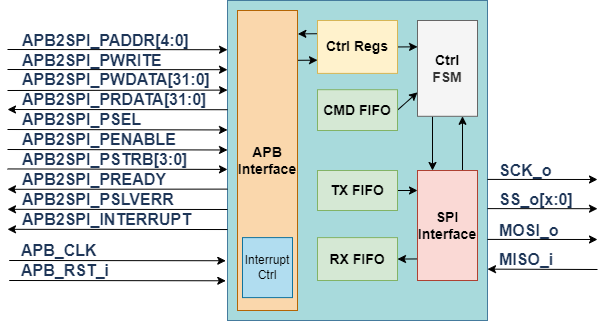

# 高级SPI控制器文档

## 结构框图

 

## 寄存器界面

|地址       |代号         |读/写   |作用       |
|-          |           -| -    |          -|
|0x00       |SPICTRL     |RW    |控制SPI的整体工作状态|
|0x04       |SPITRBUF    |R/W   |SPI的收发缓冲区|
|0x08       |SPISTAT     |RW    |SPI工作状态   |
|0x0C       |SPICS       |RW    |SPI CS#寄存器 |
|0x10       |SPICMD      |W     |命令模式命令FIFO|
|0x14       |CMDTO       |RW    |命令超时寄存器|

### SPICTRL 寄存器定义

|位         |代号         |读/写 |作用       |
|-          |           -| -    |          -|
|[31]       |VERSION     |R     |恒为1，与TinySPI做区分|
|[30]       |SPIMODE     |RW    |SPI的工作模式，为1进入命令模式 |
|[29]       |ALIGN       |RW    |开启T/R FIFO的数据对齐功能，允许主机发起32/16/8bit访问|
|[28:17]    |RESERVED    | -    |保留字段，恒为0 |
|[16]       |CTOIE       |RW    |命令超时中断 |
|[15]       |RXVIE       |RW    |RxFIFO有效中断 |
|[14]       |TXEIE       |RW    |TxFIFO空中断 |
|[13]       |RXHEIE      |RW    |RxFIFO半空中断 |
|[12]       |TXHFIE      |RW    |TxFIFO半满中断 |
|[11]       |TXRIE       |RW    |SPI空闲中断（命令FIFO空中断）|
|[10]       |TXEIE       |RW    |单次发送完成中断使能   |
|[9]        |SPICPHA     |RW    |SPI时钟极性|
|[8]        |SPICPOL     |RW    |SPI采样边沿|
|[7:0]      |SPIFDIV     |RW    |SPI时钟分频值|

备注：为了简单，该寄存器只接受32b访问，其他访问将返回总线错误

### SPITRBUF行为

（命令模式下）读取该地址如果有数据将从RxFIFO中弹出一个数据，如果RxFIFO空，则返回总线错误。写入该地址将把一个数据压入TxFIFO，如果TxFIFO满，返回总线错误。

（直通模式）该地址为SPI状态机的buffer寄存器，写入则将寄存器数据送入移位寄存器移出，移出完成后内容将为MISO移入数据,高位[15]用于标示本访问是读访问

### SPISTAT寄存器定义

|位      |代号      |读/写 |作用       |
|-       |        -| -    |          -|
|[31]    |CMDTO/RST|R/W1c |命令超时指示位，向该位写入将复位整个SPI状态机|
|[27:4]  |RSVD     | -    |保留位   |
|[5]     |RXFV     |R/W1c |RxFIFO有效事件|
|[4]     |TXFE     |R/W1c |TxFIFO满事件 |
|[3]     |RXFHE    |R/W1c |RxFIFO半空事件|
|[2]     |TXFHF    |R/W1c |TxFIFO半满事件|
|[1]     |RDY      |R     |SPI状态机空闲/命令FIFO空|
|[0]     |TXE      |R     |单次写结束|

备注：R/W意味着读写功能不同，W1c意味着向该位写1清除对应

备注2：该寄存器只接受32b访问

### SPICS寄存器

该寄存器只有最低8bit有效，在直接操作模式下可以等同于一个只写的GPIO，连接到外部SPI设备的CS#脚。在命令模式下，该寄存器由主控FSM托管，在命令模式下写入该寄存器的行为应当导致一个总线错误

### SPICMD寄存器

该寄存器是命令FIFO的写口。在命令模式下对该寄存器发起写访问将会PWDATA[11:0]压入FIFO中。只接受对该地址的32/16b访问并丢弃高位，其他访问方式将直接返回总线错误（在16b访问模式下访问高16b也应当返回总线错误）

### CMDTO寄存器

该寄存器中存放系统最大可容忍的单个命令SPI传输数（对LUR**命令有效）。如果为0则为无限制。考虑到SPI Flash的擦除需要秒级的时间，计数器位宽可能应当在24b以上。

## 控制方式

高级SPI允许使用直接操作收发寄存器或者使用命令方式对SPI界面进行操作，两种界面为二选一的操作方式。在命令模式下SPI收发缓冲区为受命令控制的FIFO，单独读写该寄存器无法发起SPI访问，只会向对应的缓冲区压入或者弹出数据。而在直接操作模式下尝试写命令寄存器则会产生总线错误。用户需要特别的区分该问题。

### 直接操作模式

在直接操作模式下，用户将bypass掉全部的FIFO直接操作SPI收发器，操作方式类似于TinySPI的操作方式，每一次操作SPI收发缓冲区都会带来一次SPI读写

### 命令模式

命令格式为12位，其中高4位为命令，低8位为数据。 其中包含如下命令

|命令       |代号         |作用       |
|-          |           -|          -|
|0x0XX      |WRCS        |将数据区段写入SPI CS#寄存器 |
|0x1XX      |SPITX       |发送TxFIFO中的数据，发送数量为数据区段+1 Byte（1~256） |
|0x2XX      |SPIRX       |发送0xFF，将MISO数据送入RxFIFO，接收数量为数据区段+1 Byte（1~256）|
|0x3XX      |SPITR       |发送TxFIFO中的数据，并将MISO数据送入RxFIFO，收发数量为数据区段+1 Byte（1~256）|
|0x8XX      |LUREO       |循环接收直到MISO接收数据中的被选位等于1，选择方式为数据区段中对应bit写1|
|0x9XX      |LUREZ       |循环接收直到MISO接收数据中的被选位等于0，选择方式为数据区段中对应bit写1|
|0xAXX      |LUREQ       |循环接收直到MISO接收数据等于数据区段中的数值|
|0xBXX      |LURNE       |循环接收直到MISO接收数据不等于数据区段中的数值|

在该执行模式下（一般的，数据读写相关的）的工作流程图如下图所示
 

